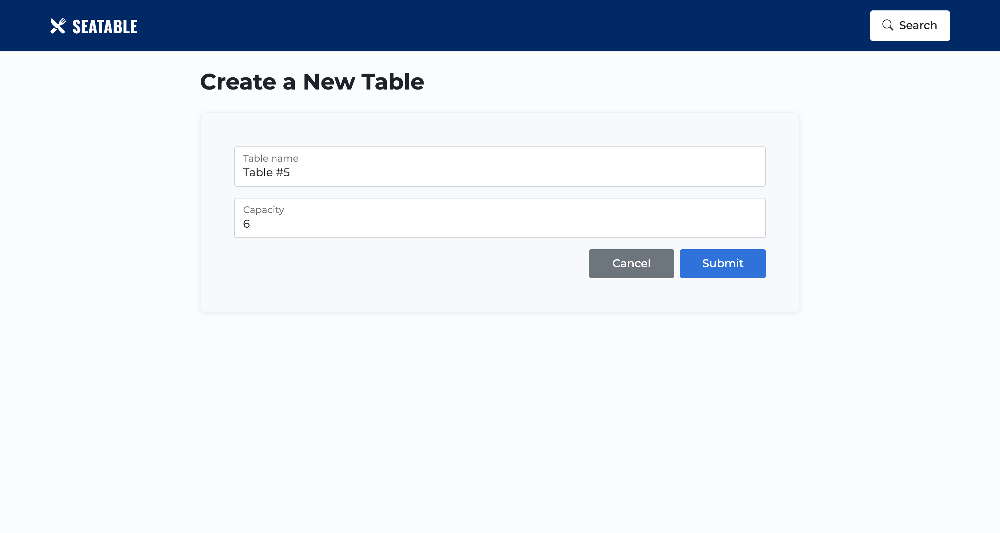

# Seatable Restaurant Reservations

### [Live Version](https://restaurant-reservation-sk.herokuapp.com/)

## Project overview

Seatable is an application that allows restaurants to manage reservations. Users can create, edit, cancel and search reservations as well as seat them at tables when they are available. Users can also create tables, and clear them when the customer leaves.

The application is web-based and fully-responsive. It features a simple user experience and a clean and uncluttered UI.

It is built using:

- React.js
- Node.js
- Express.js
- Knex.js
- PostgreSQL
- Boostrap 5
- CSS
- Heroku

## Front-end Features

#### Dashboard View

&nbsp;

This is the home screen of Seatable. Users can view reservations by date and see the status of all of the tables in the restaurant.

From here, users can manage a reservation by creating, editing, seating or, canceling, as well as adding tables and finishing them when they are clear.

#### Create a new reservation

&nbsp;

The create form is where new reservations are created. The form validates reservations based on the working days and hours of the restaurant. Reservations made in the past are also invalidated. Once a new reservation is created, the user is directed to the dashboard view selected for the date of the newly created reservation.

#### Edit a reservation

&nbsp;

If a reservation is booked, but not yet seated, its information can be edited. The same validations applied to creating a reservation are also applied here.

#### Seat a reservation

&nbsp;

When a table is ready and the reservation is present, users can 'seat' the reservation by selecting a table. Only tables with large enough capacity to accomodate the party can be selected.

#### Search for reservations

&nbsp;

Users can look up a reservation by searching for a users phone number. From here, resrvations can be edited, cancelled or seated.

#### Create a new Table

&nbsp;

This form allows users to create a new table. Tables can be named and assigned the amount of people it can seat.
